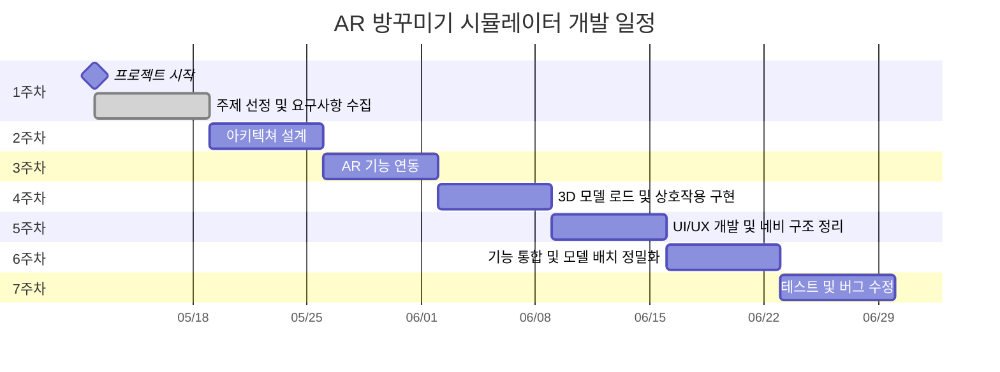

# 🛋️ AR 기반 방꾸미기 시뮬레이터
## 📌 프로젝트 개요
사용자의 실제 공간에 가구를 배치해보는 AR 기반 몰입형 인테리어 시뮬레이터 앱입니다.  
ARCore/ARKit을 통해 사용자의 방을 인식하고, 3D 모델로 구현된 가구를 직접 드래그하여 배치할 수 있습니다.  
실시간 배치, 스타일 추천, 마켓 연동 등을 통해 **IKEA처럼 내 방에서 직접 가구를 배치해보는 경험**을 제공합니다.
## 💡 개발 배경
- AR기술은 실생활 적용에 적합하고 시장 수요가 증가하는 분야
- **실제 공간에 배치하는 몰입형 인테리어 경험 부족**
- 소비자 맞춤형 가구 시뮬레이션 니즈 증가
- Flutter + AR로 구성된 기술 조합은 실제 상용화에도 근접
## 🎯 목표
- 사용자가 자신의 방에 가구를 가상 배치해볼 수 있는 앱 제공
- 가구의 위치, 회전, 크기 조정 등 직관적인 상호작용 구현
- iOS, Android 모두 지원하는 크로스 플랫폼 앱 개발
- 실제 상품 기반의 3D 가구 모델을 활용하여 몰입감 강화
- ## 🔧 사용 기술 스택
| 구분 | 기술 |
|------|------|
| 언어 | Dart |
| 프레임워크 | Flutter |
| 플랫폼 | Android / iOS |
| AR 엔진 | ARCore (Android), ARKit (iOS) via `ar_flutter_plugin` |
| 3D 모델 | `.glb`, `.gltf`, `.usdz` |
| 기타 | Firebase (옵션), REST API, AI 추천 로직 (후순위) |
## 🧪 핵심 기술
- AR로 바닥을 인식하고 3D 가구를 배치
- 배치 결과를 캡처하고 저장
- 가구 리스트 탐색 및 정보 확인이 가능
- 가구 회전, 크기 조절, 위치 이동 기능을 제공
## 📄 요구사항 정의서
| 순서 | 요구사항       | 요구항목         | 요구내용                                               | 검토의견                           | 수정여부   |
|------|----------------|------------------|--------------------------------------------------------|-----------------------------------|------------|
| 1    | AR 공간 인식    | 평면 인식        | 사용자의 실제 방 공간을 ARCore/ARKit를 이용해 평면으로 인식 | AR 인식 정확도 테스트 필요, 평면 인식 보조 UI 필요 | 예         |
| 2    | 3D 가구 모델    | 모델 포맷        | .glb 또는 .gltf 포맷의 3D 가구 모델 지원              | .usdz도 iOS 호환을 위해 추가 필요               | 예         |
| 3    | 가구 배치 기능  | 이동 및 회전     | 3D 가구 모델을 드래그, 회전하여 자유롭게 배치 가능     | UX 개선 위해 터치 제스처 최적화 필요               | 보류       |
| 4    | 방 시뮬레이터  | 시뮬레이션 모드  | 배치한 가구 상태에서 방 전체를 3D 뷰로 시뮬레이션 가능     | 사용자 인터랙션 및 렌더링 최적화 필요                | 보류       |
| 5    | 방 저장 기능   | 저장 방식        | 사용자가 배치한 가구와 방 상태를 로컬 또는 클라우드에 저장 가능 | 로컬 저장 우선, 추후 클라우드 확장 고려            | 예         |
| 6    | 공유 기능      | SNS 공유         | 저장된 방 상태를 이미지 또는 링크로 생성하여 SNS (인스타, 카카오 등) 공유 | 플랫폼 별 공유 API 연동 필요, 프라이버시 이슈 검토 | 보류       |
| 7    | UI/UX          | 인터페이스      | 직관적이고 사용하기 쉬운 UI/UX 설계                      | 사용자 테스트 후 인터페이스 수정 가능성 검토        | 보류       |
| 8    | 성능 최적화    | 경량 모드        | 저사양 기기에서도 원활히 동작하도록 경량 모드 제공        | 필요 시 렌더링 품질 조절 기능 추가 고려             | 예         |
| 9    | 라이선스 관리  | 3D 모델 라이선스 | CC0, 상업용 무료 라이선스 모델만 사용                     | 모델 출처 및 라이선스 문서 관리 필수                | 완료       |
## 📆 개발 일정

## 📈 기대 효과
- 디자인 실패를 줄이고 만족도 있는 경험 제공
- 멀티 플랫폼으로 언제 어디서나 사용 가능
- 실제 상품 데이터와 연계 가능성 보유
- 사용자 중심 AR UX 설계 역량 증명
  ## ⚠️ 리스크 관리
| 항목 | 대처 방안 |
|------|------------|
| AR 인식 불안정 | 평면 인식 보조 UI 제공 |
| 3D 모델 호환성 | `.glb` 포맷 통일 및 경량화 |
| 기기 성능 제한 | 로우엔드 기기용 경량 모드 제공 |
| 라이선스 이슈 | CC0 및 상업용 무료 모델만 사용 |

