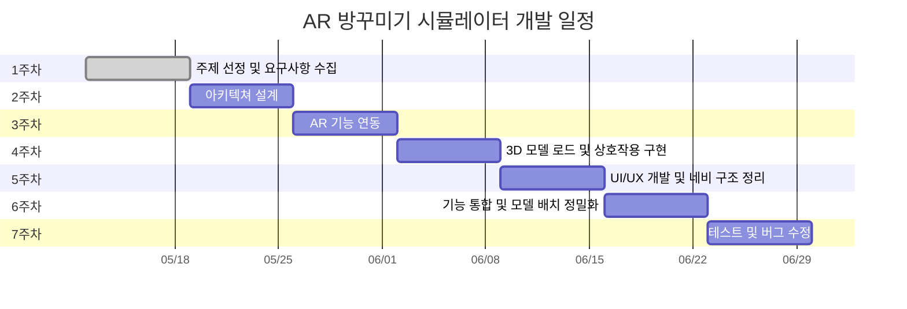

# 🛋️ AR 기반 방꾸미기 시뮬레이터
## 📌 프로젝트 개요
사용자의 실제 공간에 가구를 배치해보는 AR 기반 몰입형 인테리어 시뮬레이터 앱입니다.  
ARCore/ARKit을 통해 사용자의 방을 인식하고, 3D 모델로 구현된 가구를 직접 드래그하여 배치할 수 있습니다.  
실시간 배치, 스타일 추천, 마켓 연동 등을 통해 **IKEA처럼 내 방에서 직접 가구를 배치해보는 경험**을 제공합니다.
## 💡 개발 배경
- AR기술은 실생활 적용에 적합하고 시장 수요가 증가하는 분야
- **실제 공간에 배치하는 몰입형 인테리어 경험 부족**
- 소비자 맞춤형 가구 시뮬레이션 니즈 증가
- Flutter + AR로 구성된 기술 조합은 실제 상용화에도 근접
## 🎯 목표
- 사용자가 자신의 방에 가구를 가상 배치해볼 수 있는 앱 제공
- 가구의 위치, 회전, 크기 조정 등 직관적인 상호작용 구현
- iOS, Android 모두 지원하는 크로스 플랫폼 앱 개발
- 실제 상품 기반의 3D 가구 모델을 활용하여 몰입감 강화
## 🧪 핵심 기술
- AR로 바닥을 인식하고 3D 가구를 배치
- 배치 결과를 캡처하고 저장
- 가구 리스트 탐색 및 정보 확인이 가능
- 가구 회전, 크기 조절, 위치 이동 기능을 제공
## 🔧 사용 기술 스택
| 구분 | 기술 |
|------|------|
| 언어 | Dart |
| 프레임워크 | Flutter |
| 플랫폼 | Android / iOS |
| AR 엔진 | ARCore (Android), ARKit (iOS) via `ar_flutter_plugin` |
| 3D 모델 | `.glb`, `.gltf`, `.usdz` |
| 기타 | Firebase (옵션), REST API, AI 추천 로직 (후순위) |
## 📆 개발 일정

## 📈 기대 효과
- 디자인 실패를 줄이고 만족도 있는 경험 제공
- 멀티 플랫폼으로 언제 어디서나 사용 가능
- 실제 상품 데이터와 연계 가능성 보유
- 사용자 중심 AR UX 설계 역량 증명
  ## ⚠️ 리스크 관리
| 항목 | 대처 방안 |
|------|------------|
| AR 인식 불안정 | 평면 인식 보조 UI 제공 |
| 3D 모델 호환성 | `.glb` 포맷 통일 및 경량화 |
| 기기 성능 제한 | 로우엔드 기기용 경량 모드 제공 |
| 라이선스 이슈 | CC0 및 상업용 무료 모델만 사용 |

